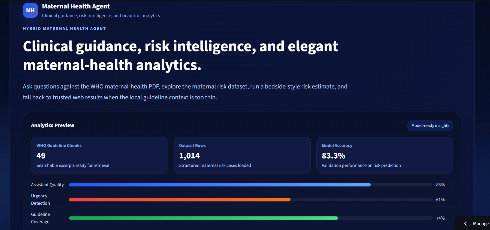
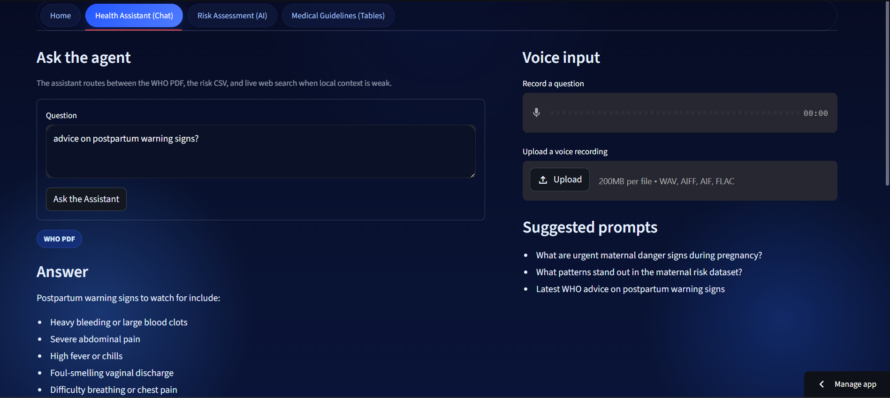
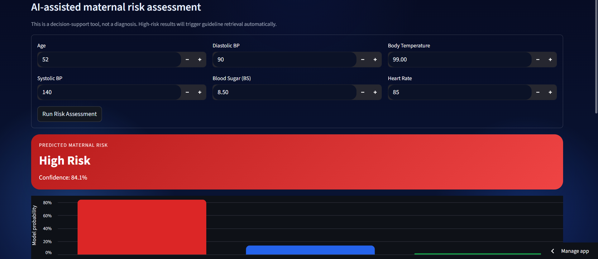

# :pregnant_woman: Maternal Health Hybrid AI Agent

> AI-powered maternal decision support that combines clinical guideline retrieval with data-driven risk assessment.


## :earth_africa: Introduction
Maternal health outcomes remain a major challenge in many regions, including Zimbabwe and other low-resource settings where timely guidance is critical. This project was built to support faster, better-informed maternal care decisions by combining:

- Retrieval-Augmented Generation (RAG) over WHO maternal-health guidance
- Clinical risk estimation from maternal vitals
- Clear, explainable outputs for frontline decision support

The goal is not to replace clinicians, but to strengthen triage, risk awareness, and access to trusted maternal guidance at the point of care.

## :sparkles: Key Features
### 1) Health Assistant (Chat)
- Asks and answers maternal-health questions using WHO guideline context
- Smart query routing between PDF guidance, dataset analytics, and web fallback
- Domain-restricted live web fallback (WHO/CDC/NIH/PubMed) for "latest" style queries
- Expandable source citations with page-level context or URLs
- Optional voice input (speech-to-text) and answer playback (text-to-speech)

### 2) Risk Assessment Tool (AI)
- Maternal risk prediction from core clinical features:
  - `Age`, `SystolicBP`, `DiastolicBP`, `BS`, `BodyTemp`, `HeartRate`
- Confidence scoring and probability chart across risk classes
- Automatic WHO guidance retrieval when profile is predicted as high risk
- Decision-support UX with clear caution messaging

### 3) Medical Guidelines & Data Tables
- Searchable table of extracted WHO guideline excerpts
- Risk distribution visualizations and vitals pattern analytics
- Quick reference dataset views for transparent exploration

### 4) Practical Enhancements We Built
- Session-level custom data mode:
  - Upload your own maternal-health PDF
  - Upload your own maternal-risk CSV
- Cached model/agent initialization for faster interactions
- Structured multi-tab Streamlit interface:
  - `Home`
  - `Health Assistant (Chat)`
  - `Risk Assessment (AI)`
  - `Medical Guidelines (Tables)`

## :brain: Hybrid Logic (How It Works)
This app uses a dual-engine architecture:

1. User question or vitals input is received in Streamlit.
2. RAG engine processes maternal-health questions:
   - Embeds WHO PDF chunks with OpenAI embeddings
   - Retrieves top FAISS matches
   - Generates answer via LangChain + OpenAI chat model
3. If confidence is low or query asks for recent/latest information, it triggers web fallback (trusted domains only).
4. Risk engine predicts maternal risk level from vitals using a tree-based classifier.
5. If risk is `high risk`, the app automatically triggers a focused guideline retrieval prompt to generate urgent recommendations.

In short: **Prediction -> Context-Aware Guidance -> Actionable Output**.

## :building_construction: Tech Stack
- **Language & App:** Python, Streamlit
- **LLM/RAG:** LangChain, OpenAI API, OpenAI Embeddings
- **Vector Search:** FAISS
- **ML & Analytics:** scikit-learn, Pandas, NumPy, Altair
- **Modeling:** Tree-based classifier pipeline (current: RandomForest, XGBoost-ready architecture)
- **Document Parsing:** PyPDF
- **Environment Management:** python-dotenv

## :open_file_folder: Project Structure
```text
health-assistant/
├── app.py
├── rag_pipeline.py
├── risk_model.py
├── requirements.txt
├── data/
│   ├── Maternal Health Risk Data Set.csv
│   ├── maternal_health.pdf
│   └── uploads/
└── README.md
```

## :rocket: Setup Instructions
### 1) Clone Repository
```bash
git clone https://github.com/<your-username>/<your-repo>.git
cd <your-repo>
```

### 2) Create Virtual Environment (Recommended)
```bash
python -m venv .venv
# Windows
.venv\Scripts\activate
# macOS/Linux
source .venv/bin/activate
```

### 3) Install Dependencies
```bash
pip install -r requirements.txt
```

### 4) Configure Environment Variables
Create a `.env` file in the project root:

```env
OPENAI_API_KEY=your_openai_api_key_here
OPENAI_CHAT_MODEL=gpt-4.1-mini
OPENAI_WEB_MODEL=gpt-5-mini
```

Optional packages for voice features:
```bash
pip install SpeechRecognition gTTS
```

### 5) Run the App
```bash
streamlit run app.py
```

## :test_tube: Usage Guide
- Open **Home** to review current dataset/guideline stats and activate optional custom PDF/CSV.
- Use **Health Assistant (Chat)** for maternal-health Q&A with cited sources.
- Use **Risk Assessment (AI)** to enter vitals and get predicted risk + confidence.
- Open **Medical Guidelines (Tables)** for filtered WHO excerpts and summary analytics.

## :framed_picture: Screenshots
Add your app screenshots below:

### Home Tab

<!-- Replace with your screenshot path -->

### Health Assistant Tab

<!-- Replace with your screenshot path -->

### Risk Assessment Tab

<!-- Replace with your screenshot path -->

### Medical Guidelines Tab

<!-- Replace with your screenshot path -->

## :bar_chart: Data Sources
1. **WHO Maternal / Antenatal Guidance**
   - WHO IRIS publication portal: https://iris.who.int/
   - Example antenatal recommendations reference: https://iris.who.int/handle/10665/250796

2. **Maternal Health Risk Dataset (UCI)**
   - UCI Machine Learning Repository: https://archive.ics.uci.edu/dataset/863/maternal+health+risk

3. **Kaggle Mirror (for accessibility/workflow convenience)**
   - Kaggle listing: https://www.kaggle.com/datasets/csafrit2/maternal-health-risk-data

## :warning: Medical Disclaimer
This project is for **educational and decision-support purposes only**. It is **not** a medical device, does **not** provide diagnosis, and should **not** replace licensed clinical judgment, local protocols, or emergency care pathways. Always consult qualified healthcare professionals for patient care decisions.

## :handshake: Contribution
Contributions are welcome. If you want to improve model performance, UI, explainability, or localization for specific health systems (including Zimbabwe-focused pathways), feel free to open an issue or PR.

## :pushpin: Future Improvements
- Upgrade/benchmark risk engine with XGBoost and calibrated probabilities
- Add multilingual support for local deployment contexts
- Introduce audit logging and clinical pathway templates
- Expand guideline corpus and offline-first deployment options

---
Built with care to support safer maternal-health decisions.
